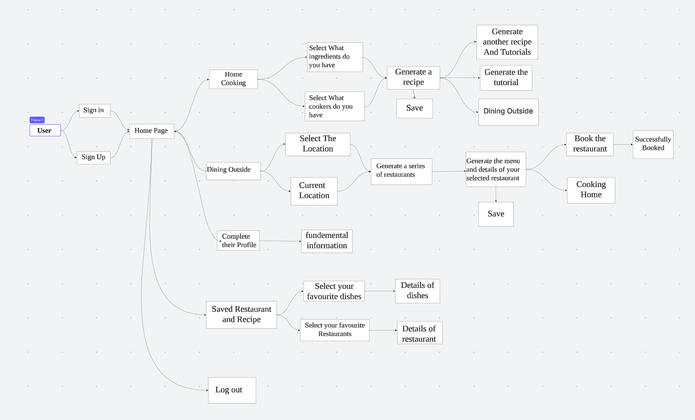

# Specification Phase Exercise

A little exercise to get started with the specification phase of the software development lifecycle. See the [instructions](instructions.md) for more detail.

## Team members

- Shipeng Zhao: [GitHub](https://github.com/Tonyzsp)  
- Yukun Dong: [GitHub](https://github.com/abccdyk)  
- Hao Yang: [GitHub](https://github.com/Hao-Yang-Hao)  
- Chuqiao Huang: [GitHub](https://github.com/ChuqiaoHuang)  

## Stakeholders

#### **Interviewees: Yinuo Song & Kevin Ni – Indecisive Eaters**  

### **Problems / Frustrations**  
- Struggles with Deciding What to Eat: This leads to repetitive meals or even skipping meals.   
- Ingredient Waste: Users often buy groceries without a plan, leading to expired/unfresh food.
- Lack of Integrated Cooking & Dining Apps: Most apps focus only on recipes or restaurant discovery, making it difficult to switch between both.  
- Unclear Nutritional Information: Users struggle to track calories, macronutrients, and meal healthiness when cooking at home.  
- Difficulty Finding Suitable Recipes: Users with dietary restrictions (gluten-free, vegan) struggle to find recipes that match their needs.  

### **Goals / Needs**  
- Easy Meal Planning: Step-by-step text or video tutorials for guided cooking.  
- Smart Ingredient Utilization: Enable users to select available food for recipe suggestions, reducing ingredient waste by recommending meals based on what's already in the kitchen.  
- Seamless Home-Cooking & Dining-Out Experience: An all-in-one platform that allows easy switching between cooking at home and finding restaurants.  
- Nutritional Insights: Each recipe includes caloric information and macronutrient breakdowns (proteins, carbs, fats).  
- Personalized Recipe Filtering: Automated meal planner that suggests recipes matching dietary preferences and filters out allergens and disliked ingredients.  

## Product Vision Statement

MealPlanner+ is an AI-powered meal planning and dining assistant that personalizes daily meals based on dietary preferences, available ingredients, and health goals, offering smart recipe suggestions, seamless grocery integration, and curated restaurant recommendations to create a stress-free, convenient, and enjoyable food experience. With a focus on convenience, nutrition, and personalization, MealPlanner+ tailors its recommendations to fit diverse lifestyles, ensuring that users have access to healthy, delicious, and suitable meal options anytime, anywhere.

## User Requirements

- As a home cook, I want to input the ingredients I have and my dietary restrictions so that I can receive personalized recipe suggestions.
- As a health-conscious eater, I want to access nutrition details of a recipe so that I can make informed decisions about my meals.
- As a busy professional, I want to quickly choose between cooking at home or finding a restaurant so that I can get relevant food options easily.
- As a beginner cook, I want to see detailed step-by-step cooking instructions with an embedded tutorial video so that I can easily follow along while cooking.
- As a food enthusiast, I want to regenerate meal suggestions if I don’t like the first set so that I can explore more recipe options
- As a traveler, I want to enter my address or use my current location so that I can get restaurant suggestions near me.
- As a foodie, I want to view restaurant details like name, cuisine type, rating, and distance so that I can make a quick decision on where to eat.
- As a diner with dietary restrictions, I want restaurant suggestions based on my preferences so that I can find suitable places to eat.
- As a frequent restaurant-goer, I want to check the restaurant’s menu, reviews, and photos so that I can determine if it fits my preferences.
- As a returning user, I want to save my favorite recipes and restaurants so that I can easily revisit them later.
- As a user with specific tastes, I want to like or dislike suggested meals and restaurants so that I can receive better recommendations over time.
- As a health-conscious individual, I want to track my past meals and nutritional intake so that I can monitor my diet more effectively.
- As a person with cultural food preferences, I want to filter meals by cuisine type so that I can find dishes that align with my tastes.

## Activity Diagrams

Details
- 1st layer：
    - Create an account 
    - Login your account 
- 2nd layer：
    - Create an account ：enter info 
    - Login your account: login with info 
- 3rd layer：
    - Your meal preferences: dietary preference, healthy goal(calories) 
    - Make your Meal plan 
    - Wanna go out for dining？ 
    - Favorite recipe/restaurant 
- 4th layer：
    - Make your Meal plan-enter ingredient you have，followed by the recipes you can choose for this meal 
    - Lack of ingredient or recipe? Grocery store recommended, nearby restaurant recommended 
- 5th layer:
    - Video tutorial of recipe

## Clickable Prototype

See instructions. Delete this line and place a publicly-accessible link to your clickable prototype here.
